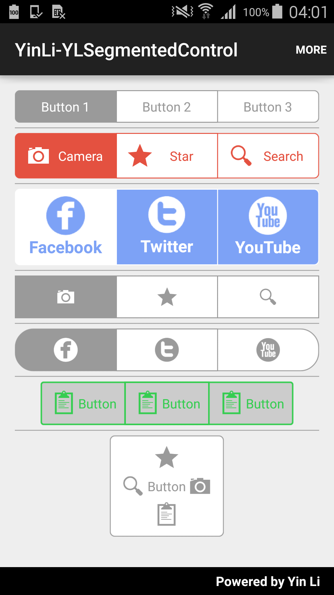
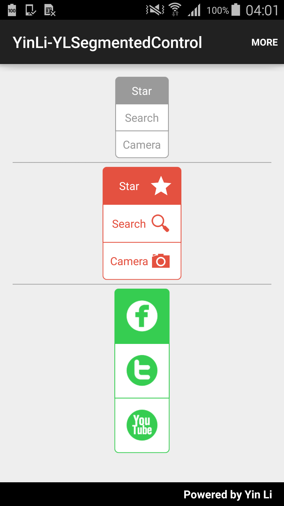
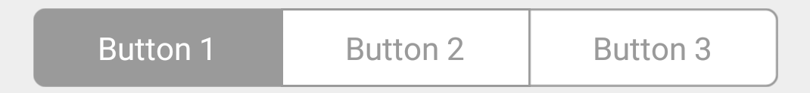
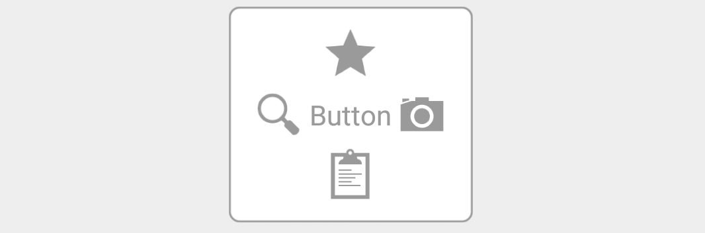
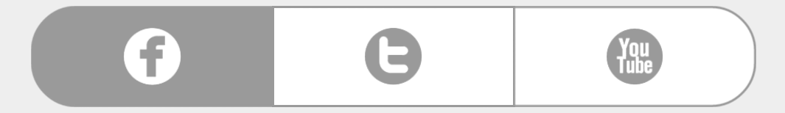

# YLSegmentedControl
A smart custom iOS-like segmented control for Android, which has a remarkable capability to handle appearances for both frame and content automatically. 

* Support any color and size image (with transparent background) as an icon. The library will automatically scale the size and replace the color for the icon image to match different styles. 
* Support various states such as "pressed", "checked", "unchecked" and "disabled".
* Support all types - text-only, image-only, and text with image.
* Support both horizontal and vertical modes.
* Easy to customize styles like active color, inactive color, length of radius, square or round, border color, etc.

#Screenshots
<br/>
<p align="center">


</p>

# Demo Project
This library comes with a demo project for you. You can download the latest demo APK from this link:
https://github.com/YinLiWisdom/Android-YLSegmentedControl/blob/master/apk/demo.apk

It's also on Google Play:

<a href="https://play.google.com/store/apps/details?id=com.yinli.yinli_ylsegmentedcontrol&hl=en_GB">
  
</a>

Having the demo project installed is a good way to be notified of new releases.

# Useage
### Step 1
#### Gradle (jCenter)
```
dependencies {
    compile "com.yinli:ylsegmentedcontrol:1.0.0"
}
```
#### Maven
```
<dependency>
	<groupId>com.yinli</groupId>
	<artifactId>ylsegmentedcontrol</artifactId>
	<version>1.0.0</version>
</dependency>
```

### Step 2
1. Add `YLSegmentedControl` into your project. 
  * The following code snippet will give you a horizontal 3-button segmented control.

    <p></p>
    ```xml
        <com.yinli.ylsegmentedcontrol.YLSegmentedRadioGroup
            android:layout_width="match_parent"
            android:layout_height="wrap_content"
            android:orientation="horizontal"
            android:weightSum="3">

            <com.yinli.ylsegmentedcontrol.YLSegmentedRadioButton
                android:id="@+id/button1"
                android:layout_width="0dp"
                android:layout_height="match_parent"
                android:layout_weight="1"
                android:checked="true"
                android:text="Button 1" />

            <com.yinli.ylsegmentedcontrol.YLSegmentedRadioButton
                android:id="@+id/button2"
                android:layout_width="0dp"
                android:layout_height="match_parent"
                android:layout_weight="1"
                android:text="Button 2" />

            <com.yinli.ylsegmentedcontrol.YLSegmentedRadioButton
                android:id="@+id/button3"
                android:layout_width="0dp"
                android:layout_height="match_parent"
                android:layout_weight="1"
                android:text="Button 3" />

        </com.yinli.ylsegmentedcontrol.YLSegmentedRadioGroup>
    ```
    It allows to change orientation by simply setting `android:orientation=""` to `horizontal` or `vertical`.
  
  * Text with image segmented button
    ```
      <com.yinli.ylsegmentedcontrol.YLSegmentedRadioButton
                android:id="@+id/button"
                android:layout_width="0dp"
                android:layout_height="match_parent"
                android:layout_weight="1"
                android:drawableLeft="@drawable/ic_action_star"
                android:text="Star" />
    ```
    The icon image will be placed on the left hand side by using above snippet, but it also supports "right", "top", and     "bottom" icon positions.
    <p></p>
  
  * Image-only segmented button
    ```
      <com.yinli.ylsegmentedcontrol.YLSegmentedImageRadioButton
                android:id="@+id/button"
                android:layout_width="0dp"
                android:layout_height="46dp"
                android:layout_weight="1"
                custom:iconImageSrc="@drawable/ic_action_star" />
    ```
    <p></p>
    
2. Customize styles
  * `activeColor`
  * `inactiveColor`
  * `borderColor`
  * `borderWeight`
  * `isRound`
  * `radius`
  
You can find more details from the demo project.

# Developed By
* Yin Li - <li.yinmax@outlook.com>

# License
    The MIT License (MIT)

    Copyright (c) 2015 Yin Li

    Permission is hereby granted, free of charge, to any person obtaining a copy
    of this software and associated documentation files (the "Software"), to deal
    in the Software without restriction, including without limitation the rights
    to use, copy, modify, merge, publish, distribute, sublicense, and/or sell
    copies of the Software, and to permit persons to whom the Software is
    furnished to do so, subject to the following conditions:

    The above copyright notice and this permission notice shall be included in all
    copies or substantial portions of the Software.

    THE SOFTWARE IS PROVIDED "AS IS", WITHOUT WARRANTY OF ANY KIND, EXPRESS OR
    IMPLIED, INCLUDING BUT NOT LIMITED TO THE WARRANTIES OF MERCHANTABILITY,
    FITNESS FOR A PARTICULAR PURPOSE AND NONINFRINGEMENT. IN NO EVENT SHALL THE
    AUTHORS OR COPYRIGHT HOLDERS BE LIABLE FOR ANY CLAIM, DAMAGES OR OTHER
    LIABILITY, WHETHER IN AN ACTION OF CONTRACT, TORT OR OTHERWISE, ARISING FROM,
    OUT OF OR IN CONNECTION WITH THE SOFTWARE OR THE USE OR OTHER DEALINGS IN THE
    SOFTWARE.
